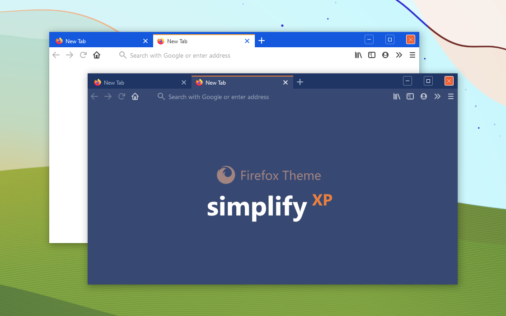

# Simplify XP for Firefox

**DESCRIPTION:** a minimal Firefox Theme for those who would like to properly enjoy my [Simplify 10 XP - Windows 10 Themes](https://gumroad.com/l/wRlqw)

**WALLPAPER USED:** [Blissed](https://gumroad.com/l/FQWog)

**INSTALLATION INSTRUCTIONS:**

- load about:config in the Firefox address bar, then search for toolkit.legacyUserProfileCustomizations.stylesheets and set it to True by double clicking the "Value" column.
- now go to your profile folder. You can do it like this: load about:support in your Firefox addressbar and click on the "Open Folder" button next to "Profile Folder" label.
- if no "chrome" folder exists there, please create one.
- now copy the included userChrome.css and userContent.css files to that "chrome" folder.
- make sure you use the Default Firefox theme and the Compact Density in the Customize settings for best results. To enable the Compact Density option, go to about:config and toggle browser.compactmode.show value to true.
- restart Firefox and enjoy!
